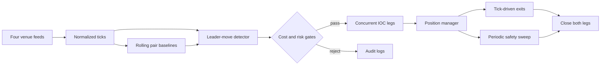

# Spread Hunter

### Event-driven cross-exchange perpetual-futures research system

**English** · [简体中文](README.zh-CN.md) · [Architecture](docs/ARCHITECTURE.md) · [Operations](docs/OPERATIONS.md)

Spread Hunter studies short-lived price dislocations between perpetual-futures venues. It treats Binance and OKX as price-discovery venues and Gate and Bitget as follower venues, estimates the normal spread for each venue pair with a rolling median, and emits a candidate only when a leader move and a same-direction spread anomaly occur together.

The repository follows the complete path from public market data to guarded two-leg execution: symbol selection, WebSocket normalization, online baseline estimation, signal filtering, transaction-cost evaluation, concurrent IOC submission, position recovery, exit monitoring, and capital rebalancing.

> Research software for educational use. It is not investment advice and does not claim profitability.

## System at a glance



| Layer | Implementation |
|---|---|
| Market universe | Top-volume USDT perpetuals available on all four venues; refreshed periodically |
| Market data | Concurrent WebSocket feeds normalized to a common `Tick` model |
| Online state | Rolling-median baseline maintained per leader–follower–symbol tuple |
| Signal | Leader move and baseline-relative anomaly must agree in direction; per-direction cooldown |
| Execution | Fee, funding, slippage, minimum-notional, concentration, and rate-limit checks before concurrent IOC orders |
| Recovery | Immediate reversal when only one opening leg fills; legacy positions are loaded at live startup |
| Exit | Funding protection, timeout, take-profit, and stop-loss evaluated from fill-based two-leg PnL |
| Observability | Structured CSV records, parameter snapshots, runtime summaries, and optional Feishu alerts |

## Research logic

For leader venue \(L\), follower venue \(F\), and symbol \(s\), the instantaneous spread in basis points is

$$
S_t^{L,F,s}=10^4\frac{P_t^L-P_t^F}{P_t^F}.
$$

The online baseline \(B_t^{L,F,s}\) is a rolling median. The detector works with the residual

$$
A_t^{L,F,s}=S_t^{L,F,s}-B_t^{L,F,s},
$$

rather than the raw spread. This separates a temporary dislocation from a persistent venue premium. A candidate event requires both a sufficiently large leader return within `LEADER_WINDOW_MS` and a same-direction residual above `ANOMALY_MIN_PCT`. Detection and execution are separate stages: `trader/cost_model.py` can still reject the event after fees, funding, order-book slippage, and contract constraints are considered.

The current default parameters are configuration values, not empirical claims. No return series or benchmark result is bundled with this repository.

## Execution and failure boundaries

Two opening legs are dispatched through `asyncio.gather`. The system does not assume atomicity across exchanges, so partial success is an explicit state: if one venue accepts and fills while the other fails, the filled leg is reversed immediately. Open positions are checked from incoming ticks and by a periodic sweep; WebSocket reconnects also trigger a position scan.

Risk state is independent from signal state. Daily-loss halt, post-stop-loss entry suspension, per-symbol concentration, per-exchange order-rate limits, consecutive-failure cooldown, and cash-distribution checks can all prevent a technically valid signal from becoming an order.

## Repository map

```text
spread_hunter_python/
├── main.py                 # Process lifecycle and live-mode preflight
├── tracker/                # Feeds, universe, baselines, signals, spread logs
├── trader/                 # Cost model, exchange adapters, execution, positions, risk
├── rebalance/              # Cash-distribution checks and transfer planning
├── test_demo/              # Demo/testnet integration checks
├── test_live/              # Read-only and explicitly confirmed live checks
├── tools/                  # Account, cash-flow, reachability, and recovery utilities
├── clients/                # Venue URLs, symbol mapping, credential examples
├── server/                 # Deployment and synchronization helpers
├── docs/                   # Architecture and operating documentation
└── logs/                   # Runtime outputs and parameter snapshots
```

Module-level detail and lifecycle diagrams are in [Architecture](docs/ARCHITECTURE.md). Operational safeguards and command classifications are in [Operations](docs/OPERATIONS.md).

## Quick start

### 1. Create an isolated environment

```bash
python -m venv .venv
# Linux/macOS
source .venv/bin/activate
# Windows PowerShell
.venv\Scripts\Activate.ps1

pip install aiohttp websockets requests urllib3
pip install orjson  # optional JSON acceleration
```

Python 3.10 or newer is required. The root project currently does not ship a locked dependency file; record the resolved versions when reproducing an experiment.

### 2. Configure demo credentials

Copy `clients/api_keys_demo.example.py` to `clients/api_keys_demo.py`, then supply testnet/demo credentials. Credential files are excluded by `.gitignore`. See [CONFIG_GUIDE.md](CONFIG_GUIDE.md) for venue-specific fields and secret-handling options.

### 3. Validate before running

```bash
# Demo integration suite; use --skip-orders for checks that do not submit orders
python -m test_demo.run_all --skip-orders

# Market-data tracker only; never submits orders
python -m tracker

# Default application mode: demo/testnet
python main.py
```

Live mode is intentionally not a one-line quick-start path. It uses live credentials, performs a read-only preflight, and requires an exact `YES` confirmation before continuing:

```bash
python main.py --live
```

Read [Operations](docs/OPERATIONS.md) before using any live command. Some scripts in `test_live/` and `rebalance/` can place orders, transfer assets, or request withdrawals.

## Default runtime parameters

| Concern | Configuration |
|---|---|
| Baseline warm-up / window | `60 s` / `2,000 ticks` |
| Leader window / move threshold | `1,000 ms` / `0.3%` |
| Minimum anomaly | `0.5%` |
| Capital per pair | `1%` of the minimum futures balance across venues, both legs combined |
| Leverage | `1×` |
| Take-profit / stop-loss | `0.20%` / `8.0%` combined position PnL |
| Maximum holding time | `8 h` |
| Daily balance halt | below `95%` of the day-start balance |

Source of truth: [`tracker/config.py`](tracker/config.py) and [`trader/config.py`](trader/config.py). Values above describe the current checked-in defaults and may change.

## Verification scope

The repository contains exchange-facing integration checks rather than a hermetic unit-test suite:

- demo balance, position, order, cancellation, and transfer flows;
- live read-only connectivity, account, order-book, contract, and funding checks;
- opt-in live order and transfer checks with explicit confirmations;
- operational utilities for account inspection and residual-exposure recovery.

Results depend on exchange availability, account permissions, network region, and credentials. A passing integration run is not evidence of strategy profitability.

## Documentation

- [Architecture and design decisions](docs/ARCHITECTURE.md)
- [Operations, validation, and safety](docs/OPERATIONS.md)
- [API configuration guide / API 配置指南](CONFIG_GUIDE.md)
- [Command reference](RUN.txt)
- [Server deployment notes](server/server_deployment_instructions.txt)

## Security and limitations

- Never commit API keys, withdrawal addresses, `.env` files, or generated logs.
- Use least-privilege keys; disable withdrawals unless rebalancing is deliberately enabled.
- Exchange APIs do not provide a cross-venue transaction, so temporary one-sided exposure cannot be eliminated completely.
- The baseline and thresholds are heuristic online statistics. Regime shifts, thin books, latency, rate limits, and venue outages can invalidate their assumptions.
- The repository does not include a historical backtester, formal latency benchmark, profitability report, or production SLA.

## License

No open-source license has been declared. All rights remain with the repository owner unless a license is added.
