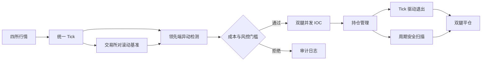

# Spread Hunter

### 事件驱动的跨交易所永续合约研究系统

[English](README.md) · **简体中文** · [系统架构](docs/ARCHITECTURE.zh-CN.md) · [运行手册](docs/OPERATIONS.zh-CN.md)

Spread Hunter 用于研究永续合约交易所之间的短时价格错位。系统将 Binance、OKX 作为价格发现端，将 Gate、Bitget 作为跟随端，通过滚动中位数估计每一交易所组合的常态价差；只有领先端价格异动与同方向价差异常同时出现时，才生成候选信号。

仓库覆盖从公开行情到受约束双腿执行的完整链路：标的筛选、WebSocket 数据归一化、在线基准估计、信号过滤、交易成本评估、并发 IOC 下单、持仓恢复、退出监控与资金再平衡。

> 仅用于研究与教学，不构成投资建议，也不对盈利能力作出声明。

## 系统一览



| 层级 | 实现 |
|---|---|
| 标的池 | 四所共同支持的高成交额 USDT 永续合约，定期刷新 |
| 行情层 | 并发 WebSocket 接入，并归一化为统一 `Tick` 模型 |
| 在线状态 | 按“领先所—跟随所—标的”维护滚动中位数基准 |
| 信号层 | 领先端异动与相对基准异常须方向一致；按标的和方向冷却 |
| 执行层 | 手续费、资金费、滑点、最小名义价值、集中度及频率校验后，并发提交 IOC |
| 恢复层 | 开仓仅一腿成交时立即反向平仓；实盘启动时加载遗留持仓 |
| 退出层 | 基于真实成交价的双腿盈亏，检查资金费、超时、止盈与止损 |
| 可观测性 | CSV 记录、参数快照、运行摘要与可选飞书告警 |

## 研究逻辑

对领先交易所 \(L\)、跟随交易所 \(F\) 和标的 \(s\)，即时价差（基点）定义为：

$$
S_t^{L,F,s}=10^4\frac{P_t^L-P_t^F}{P_t^F}.
$$

在线基准 \(B_t^{L,F,s}\) 取滚动中位数，检测器使用残差：

$$
A_t^{L,F,s}=S_t^{L,F,s}-B_t^{L,F,s},
$$

而不是直接使用绝对价差，从而区分短时错位与长期存在的交易所溢价。候选事件要求：领先端在 `LEADER_WINDOW_MS` 内的收益率超过阈值，且同方向残差达到 `ANOMALY_MIN_PCT`。检测与执行相互分离；即使产生信号，`trader/cost_model.py` 仍可根据手续费、资金费、盘口滑点和合约约束拒绝下单。

当前默认参数只是配置值，不代表统计结论。仓库中未附带收益曲线或基准测试结果。

## 执行与故障边界

开仓双腿通过 `asyncio.gather` 并发提交。系统不假设跨交易所具备原子性，因此将部分成功作为显式状态处理：一侧成交、另一侧失败时，立即反向平掉已成交腿。持仓同时接受实时 Tick 检查和周期扫描；WebSocket 重连也会触发持仓复查。

风控状态与信号状态相互独立。日内亏损停机、止损后当日禁开、单标的集中度、单所下单频率、连续失败冷却以及现金分布检查，均可阻止一个技术上有效的信号转化为订单。

## 仓库结构

```text
spread_hunter_python/
├── main.py                 # 进程生命周期与实盘预检
├── tracker/                # 行情、标的池、基准、信号和价差日志
├── trader/                 # 成本模型、交易所适配、执行、持仓和风控
├── rebalance/              # 现金分布检查与转账路径规划
├── test_demo/              # Demo/测试网集成检查
├── test_live/              # 只读检查及需明确确认的实盘检查
├── tools/                  # 账户、流水、连通性与故障恢复工具
├── clients/                # URL、标的映射与密钥示例
├── server/                 # 部署及同步辅助脚本
├── docs/                   # 架构与运行文档
└── logs/                   # 运行输出与参数快照
```

模块边界和生命周期图见[系统架构](docs/ARCHITECTURE.zh-CN.md)，操作风险分级见[运行手册](docs/OPERATIONS.zh-CN.md)。

## 快速开始

### 1. 创建隔离环境

```bash
python -m venv .venv
# Linux/macOS
source .venv/bin/activate
# Windows PowerShell
.venv\Scripts\Activate.ps1

pip install aiohttp websockets requests urllib3
pip install orjson  # 可选：加速 JSON 解析
```

项目要求 Python 3.10 或更高版本。仓库根目录目前没有锁定依赖版本的文件；复现实验时应记录实际安装版本。

### 2. 配置 Demo 密钥

将 `clients/api_keys_demo.example.py` 复制为 `clients/api_keys_demo.py`，填写测试网/Demo 密钥。密钥文件已被 `.gitignore` 排除。各交易所字段和密钥管理方式见 [CONFIG_GUIDE.md](CONFIG_GUIDE.md)。

### 3. 先验证，再运行

```bash
# Demo 集成检查；--skip-orders 跳过提交订单的步骤
python -m test_demo.run_all --skip-orders

# 仅运行行情跟踪器，不会下单
python -m tracker

# 默认以 Demo/测试网模式启动
python main.py
```

实盘模式不会作为一条无提示的快捷命令执行：程序使用实盘密钥，先运行只读预检，再要求输入完全匹配的 `YES` 才会继续。

```bash
python main.py --live
```

使用任何实盘命令前请阅读[运行手册](docs/OPERATIONS.zh-CN.md)。`test_live/` 与 `rebalance/` 中的部分脚本会下单、划转资产或发起提现。

## 默认运行参数

| 关注项 | 配置 |
|---|---|
| 基准预热 / 窗口 | `60 秒` / `2,000 ticks` |
| 领先端窗口 / 异动阈值 | `1,000 ms` / `0.3%` |
| 最低异常幅度 | `0.5%` |
| 单套利对资金 | 各所期货余额最小值的 `1%`，两腿合计 |
| 杠杆 | `1×` |
| 止盈 / 止损 | 双腿合并盈亏 `0.20%` / `8.0%` |
| 最长持仓 | `8 小时` |
| 日内余额停机线 | 低于日初余额的 `95%` |

参数真值来源为 [`tracker/config.py`](tracker/config.py) 与 [`trader/config.py`](trader/config.py)。上表仅描述当前提交中的默认值，后续可能变化。

## 验证范围

仓库提供的是面向交易所的集成检查，而不是与外部环境隔离的单元测试套件：

- Demo 余额、持仓、订单、撤单与划转流程；
- 实盘只读的连通性、账户、订单簿、合约与资金费检查；
- 需要主动选择并明确确认的实盘下单与划转检查；
- 用于账户检查和残留敞口恢复的运维工具。

检查结果受交易所可用性、账户权限、网络区域与密钥影响。集成检查通过不代表策略具有盈利能力。

## 文档

- [系统架构与设计取舍](docs/ARCHITECTURE.zh-CN.md)
- [运行、验证与安全手册](docs/OPERATIONS.zh-CN.md)
- [API 配置指南 / API Configuration Guide](CONFIG_GUIDE.md)
- [命令速查](RUN.txt)
- [服务器部署说明](server/server_deployment_instructions.txt)

## 安全与局限

- 不要提交 API Key、提现地址、`.env` 文件或运行日志。
- 使用最小权限密钥；除非明确启用再平衡，否则关闭提现权限。
- 交易所之间不存在跨平台事务，系统无法彻底消除短时单边敞口。
- 基准和阈值属于启发式在线统计；市场状态切换、盘口过薄、网络延迟、限频与交易所故障均可能破坏假设。
- 仓库当前不包含历史回测器、正式延迟基准、收益报告或生产 SLA。

## 许可证

仓库尚未声明开源许可证。在许可证加入前，相关权利由仓库所有者保留。
