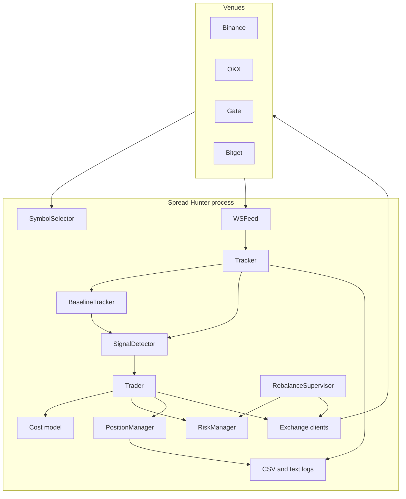
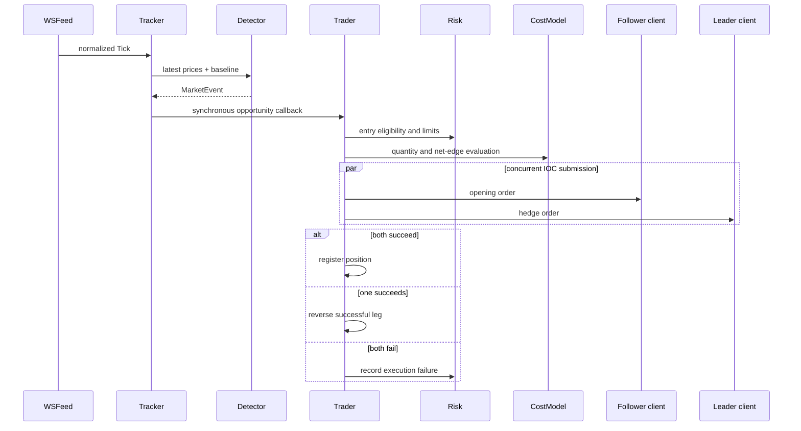

# Architecture

[简体中文](ARCHITECTURE.zh-CN.md) · [Project overview](../README.md) · [Operations](OPERATIONS.md)

This document describes the checked-in implementation. It distinguishes architectural behavior from trading hypotheses and does not infer performance that has not been measured.

## Context and boundaries

Spread Hunter is one Python process with an `asyncio` event loop. It communicates directly with Binance, OKX, Gate, and Bitget over public WebSocket/REST endpoints and authenticated REST endpoints. No database, broker, or external cache sits on the signal path.

The event loop reduces coordination overhead, but it also creates a discipline: synchronous callbacks on the tick path must remain short. Network work is scheduled as asynchronous tasks outside those callbacks.

## Component responsibilities

| Component | Owns | Does not own |
|---|---|---|
| `clients/` | Endpoint selection, symbol conversion, exchange lists | Trading policy |
| `tracker/symbol_selector.py` | Common, liquid symbol universe | Position sizing |
| `tracker/ws_feed.py` | Connections, subscriptions, parsing, reconnects | Signal interpretation |
| `tracker/baseline.py` | Rolling spread state and warm-up | Order decisions |
| `tracker/signal_detector.py` | Leader history, anomaly tests, cooldowns | Transaction costs |
| `tracker/tracker.py` | Data-plane orchestration and callbacks | Authenticated execution |
| `trader/cost_model.py` | Fee, funding, slippage, quantity feasibility | Order transport |
| `trader/exchange_client.py` | Authenticated venue-specific REST operations | Cross-venue policy |
| `trader/risk.py` | Halts, limits, cooldowns, liquidity state | Signal generation |
| `trader/position_manager.py` | Open-position registry and trade records | Market-data collection |
| `trader/trader.py` | Entry/exit orchestration and failure recovery | Raw feed parsing |
| `rebalance/` | Cash distribution, route planning, transfers | Alpha signal |

## Data plane

1. `SymbolSelector` ranks Binance USDT perpetuals by reported 24-hour volume, intersects the result with instruments supported on the other active venues, and applies the minimum-volume filter.
2. `WSFeed` opens venue-specific streams and maps payloads into `Tick(exchange, symbol, bid, ask, mid, ts_ns)`.
3. `Tracker` stores the latest tick per venue and symbol, updates the rolling baseline, and evaluates the detector after warm-up.
4. A candidate `MarketEvent` is passed directly to the registered trader callback. The queue remains as a fallback when no callback is registered.
5. Spread snapshots and signal records are written independently of whether the trader later accepts the event.

The direct callback implements latest-arrival processing without an intermediate cross-process queue. It is a latency-oriented choice, not a latency guarantee; the repository contains no formal benchmark.

## Signal state

For every leader–follower–symbol tuple, `BaselineTracker` stores a bounded history of spread observations. Recalculation is throttled by `BASELINE_UPDATE_MS`, and signal production is disabled during `BASELINE_WARMUP_S`.

`SignalDetector` separately stores recent leader prices. It prunes observations outside `LEADER_WINDOW_MS`, calculates the leader move, and tests follower residuals against the pair baseline. A per-symbol, per-direction timestamp suppresses repeated events inside `COOLDOWN_MS`.

The detector produces a market observation, not an order instruction. Direction, expected gross edge, and contextual prices travel in `MarketEvent`; execution feasibility is evaluated later.

## Entry sequence

The cost model incorporates configured taker fees, expected holding-period funding, BBO-derived slippage, contract multipliers, precision, and venue minimums. The resulting quantity must also satisfy risk and balance constraints.

## Position lifecycle

A `Position` contains two `Leg` values with venue, side, quantity, notional, and actual fill data. Live startup queries exchanges and reconstructs legacy positions so that pre-existing exposure enters the same monitoring path.

Exit evaluation is driven by current prices and actual entry fills. Protection layers overlap deliberately:

- incoming ticks trigger immediate position checks;
- a five-second sweep re-evaluates positions from cached prices;
- WebSocket reconnect callbacks request a position scan;
- a one-second timer enforces the maximum holding time.

Exit priority in the current code is unfavorable funding near settlement, timeout, take-profit, then stop-loss. Close orders are submitted concurrently. A close-leg failure is logged at critical severity and sent to Feishu when configured; the operator must inspect possible residual exposure.

## Risk and capital state

`RiskManager` holds process-level state rather than embedding limits in the signal detector. Its checks include:

- daily balance halt and process exit after positions are flat;
- no new entries after a stop-loss until UTC midnight;
- maximum positions per pair and symbol;
- maximum symbol notional as a fraction of equity;
- maximum order count per exchange per minute;
- cooldown after consecutive execution failures;
- cash-ratio and per-venue balance conditions used by rebalancing.

This separation allows the same market event to be logged while execution is blocked for operational reasons.

## Persistence and observability

The system intentionally uses files rather than a database:

| Artifact | Purpose |
|---|---|
| `logs/params.json` | Configuration snapshot written at tracker startup |
| `logs/signals.csv` | Candidate signals |
| `logs/spread_snapshots.csv` | Periodic raw spread and baseline observations |
| `logs/trades.csv` | Position lifecycle records |
| `logs/main.log`, `logs/tracker.log` | Operational events and failures |

Generated logs are excluded from version control. This design is easy to inspect and portable for a single-process research system; it does not provide transactional persistence, multi-process coordination, or distributed querying.

## Design trade-offs

| Choice | Benefit | Boundary |
|---|---|---|
| One event loop | Small deployment surface and direct in-memory state | CPU-heavy work can delay all tasks |
| Rolling median | Resistant to isolated spread spikes | Fixed window adapts imperfectly to regime shifts |
| Direct opportunity callback | No queue backlog on the normal path | Callback work must remain short |
| Concurrent two-leg submission | Reduces avoidable sequential delay | Cannot make two venues atomic |
| File-based logs | Transparent and dependency-light | No transactional recovery guarantee |
| Venue adapters behind a common interface | Central policy with localized API differences | Exchange schema changes still require maintenance |

## Extension points

The existing boundaries support several research extensions without rewriting the transport layer: alternative robust baselines, volatility-conditioned thresholds, replay/backtest adapters producing `Tick` objects, calibrated slippage models, and structured metrics exporters. These are extension directions, not features currently implemented.
