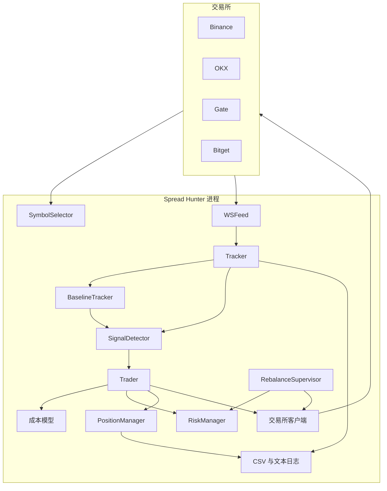
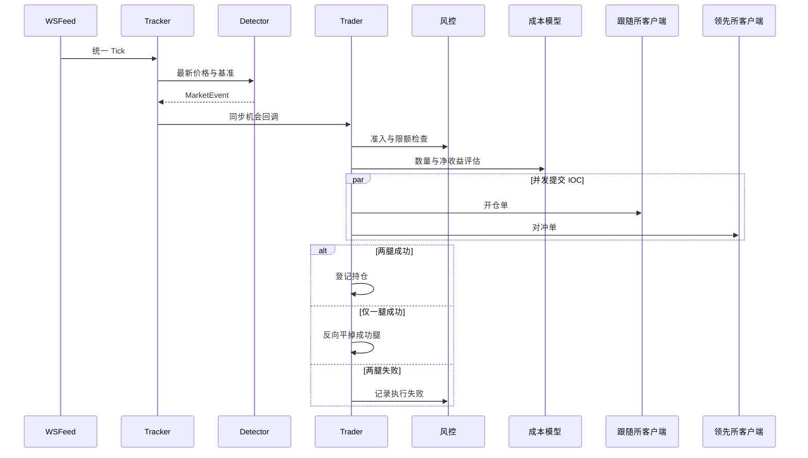

# 系统架构

[English](ARCHITECTURE.md) · [项目概览](../README.zh-CN.md) · [运行手册](OPERATIONS.zh-CN.md)

本文描述仓库中已经实现的结构，区分工程行为与交易假设，不推断未经测量的性能。

## 系统边界

Spread Hunter 以单个 Python 进程和一个 `asyncio` 事件循环运行，通过公开 WebSocket/REST 与鉴权 REST 接口直连 Binance、OKX、Gate、Bitget。信号路径上没有数据库、消息代理或外部缓存。

单事件循环减少了协调开销，也带来明确约束：Tick 路径上的同步回调必须保持短小，网络操作需作为异步任务调度到回调之外。

## 组件职责

| 组件 | 负责 | 不负责 |
|---|---|---|
| `clients/` | 端点、合约格式转换、交易所分组 | 交易策略 |
| `tracker/symbol_selector.py` | 共同且高流动性的标的池 | 仓位规模 |
| `tracker/ws_feed.py` | 连接、订阅、解析、重连 | 信号解释 |
| `tracker/baseline.py` | 滚动价差状态与预热 | 下单决策 |
| `tracker/signal_detector.py` | 领先端历史、异常检测、冷却 | 交易成本 |
| `tracker/tracker.py` | 数据面编排与回调 | 鉴权交易 |
| `trader/cost_model.py` | 手续费、资金费、滑点、数量可行性 | 订单传输 |
| `trader/exchange_client.py` | 各所鉴权 REST 操作 | 跨所决策 |
| `trader/risk.py` | 停机、限额、冷却、流动性状态 | 信号生成 |
| `trader/position_manager.py` | 开放持仓登记与交易记录 | 行情采集 |
| `trader/trader.py` | 开平仓编排与故障恢复 | 原始行情解析 |
| `rebalance/` | 现金分布、路径规划、转账 | Alpha 信号 |

## 数据链路

1. `SymbolSelector` 按 Binance 报告的 24 小时成交额排序 USDT 永续合约，与其他启用交易所的合约取交集，再应用最低成交额过滤。
2. `WSFeed` 建立各所专用行情连接，将消息映射为 `Tick(exchange, symbol, bid, ask, mid, ts_ns)`。
3. `Tracker` 保存每个交易所和标的的最新 Tick，更新滚动基准，并在预热结束后调用检测器。
4. 候选 `MarketEvent` 直接交给已注册的 Trader 回调；未注册回调时，队列作为后备路径。
5. 无论 Trader 最终是否接受事件，价差快照与信号都会独立记录。

直接回调避免了正常路径上的跨进程队列积压，是面向延迟的设计选择，但不是延迟承诺；仓库当前没有正式性能基准。

## 信号状态

`BaselineTracker` 为每个“领先所—跟随所—标的”组合保存有界价差历史。基准重算受 `BASELINE_UPDATE_MS` 节流，在 `BASELINE_WARMUP_S` 期间禁止发出信号。

`SignalDetector` 单独维护近期领先端价格，清除 `LEADER_WINDOW_MS` 之外的样本，计算领先端变动，再用组合基准检查跟随端残差。每标的、每方向的时间戳抑制 `COOLDOWN_MS` 内的重复事件。

检测器输出的是市场观察，而不是下单指令。方向、预期毛收益和上下文价格通过 `MarketEvent` 传递，执行可行性由后续阶段判断。

## 开仓时序

成本模型考虑配置中的 taker 手续费、预估持仓期资金费、由 BBO 推导的滑点、合约乘数、精度和交易所最低要求。最终数量还必须满足风控和余额约束。

## 持仓生命周期

`Position` 包含两条 `Leg`，记录交易所、方向、数量、名义价值和真实成交数据。实盘启动会查询交易所并重建遗留持仓，使既有敞口进入与新持仓相同的监控路径。

退出依据是当前价格和真实入场成交价。多层保护有意重叠：

- 新 Tick 到达时立即检查持仓；
- 每五秒使用缓存价格重新扫描；
- WebSocket 重连时请求持仓复查；
- 每秒定时器保证最长持仓时间生效。

当前退出优先级依次为：临近结算的不利资金费、超时、止盈、止损。双腿平仓并发提交。若一条平仓腿失败，系统记录 critical 日志，并在已配置时发送飞书告警；操作者必须检查可能的残留敞口。

## 风控与资金状态

`RiskManager` 保存进程级状态，而不是把限额嵌入信号检测器。检查项包括：

- 日内余额停机，持仓清空后退出进程；
- 止损后至 UTC 午夜禁止新开仓；
- 单套利对和单标的最大持仓数；
- 单标的名义价值占权益上限；
- 单所每分钟最大下单次数；
- 连续执行失败后的冷却；
- 再平衡使用的现金比例与单所余额条件。

因此，同一个市场事件可以被完整记录，同时因为运维状态而被拒绝执行。

## 持久化与可观测性

系统有意使用文件而非数据库：

| 产物 | 用途 |
|---|---|
| `logs/params.json` | Tracker 启动时写入的配置快照 |
| `logs/signals.csv` | 候选信号 |
| `logs/spread_snapshots.csv` | 周期价差和基准观测 |
| `logs/trades.csv` | 持仓生命周期记录 |
| `logs/main.log`、`logs/tracker.log` | 运维事件与错误 |

生成日志不会进入版本控制。这种方式便于检查，也适合单进程研究系统，但不提供事务持久化、多进程协调或分布式查询能力。

## 设计取舍

| 选择 | 收益 | 边界 |
|---|---|---|
| 单事件循环 | 部署面小，状态可直接共享 | CPU 密集任务会拖延全部协程 |
| 滚动中位数 | 对孤立价差尖峰更稳健 | 固定窗口难以完美适应状态切换 |
| 直接机会回调 | 正常路径无队列积压 | 回调必须保持短小 |
| 双腿并发提交 | 减少可避免的串行等待 | 无法让两个交易所具备原子性 |
| 文件日志 | 透明、依赖少 | 不保证事务式恢复 |
| 统一接口下的交易所适配器 | 集中策略、局部处理 API 差异 | 仍需跟随交易所接口变更维护 |

## 扩展接口

现有边界可支持替代稳健基准、波动率条件阈值、输出 `Tick` 的回放/回测适配器、校准后的滑点模型和结构化指标导出器，而无需重写传输层。这些是可扩展方向，并非当前已经实现的功能。
